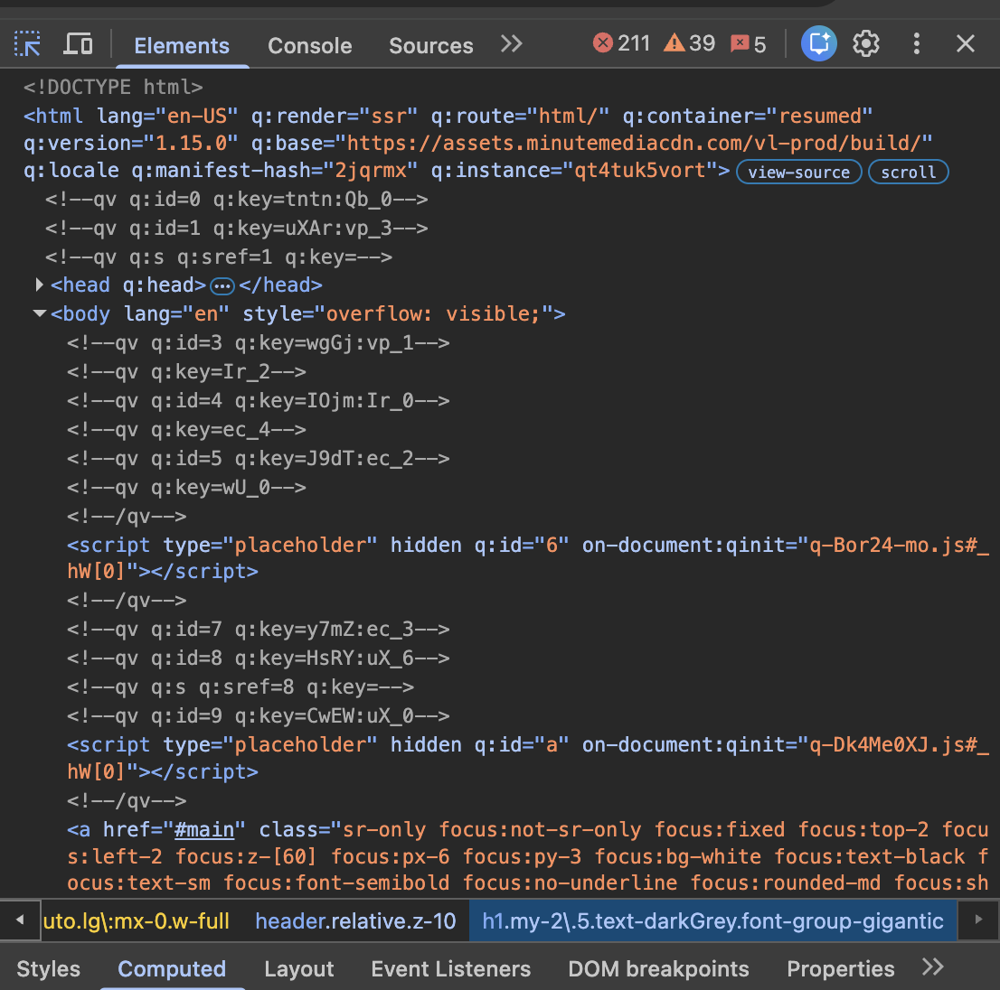
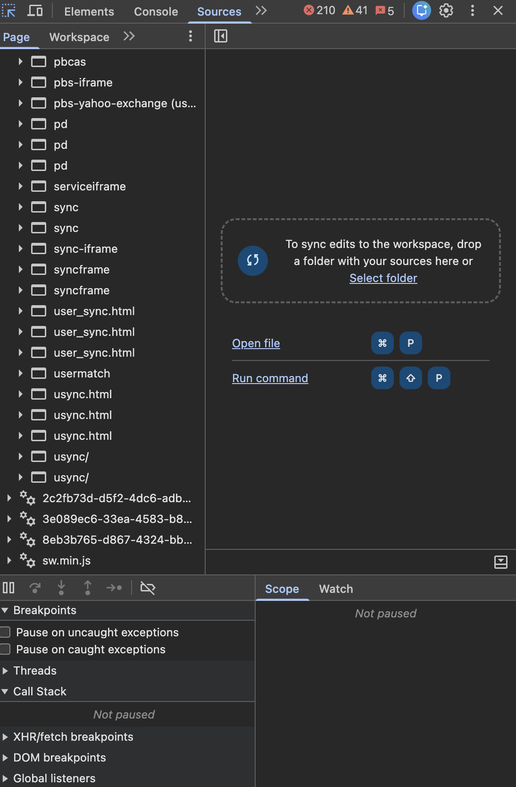

Assignment 1: Inspecting the Cultural Web

Site: [Sports Illustrated](https://www.si.com/college/usc/basketball/usc-basketball-bronny-james-still-lapping-other-ncaa-athletes-with-top-nil-value-ml0802), si.com
Page: USC Basketball article on Bronny James and his NIL value, published October 23, 2023

Why I picked this site: It ties into my individual project on NIL earnings in college sports, and it gave me a real, live site to dig into instead of describing something from the outside.

What web technologies are used

The page starts with a normal DOCTYPE and has the usual html, head, and body tags. So far, that is just plain HTML.

The html tag also carries a set of attributes that start with q: things like q:render="ssr", q:version="1.15.0", and a q:base pointing to assets.minutemediacdn.com. I had never seen these before, so I looked them up. They belong to Qwik, a JavaScript framework built for fast page loading.

Inside the body, I found real script tags linking to actual JavaScript files: q-Bor24-mo.js and q-Dk4Me0XJ.js, both hosted on assets.minutemediacdn.com. These load small pieces of code only when the page actually needs them, instead of loading one huge file up front.

The class names on elements are short and reusable, like text-darkGrey, font-group-gigantic, and flex items-center justify-between. That style comes from a utility-based CSS system, similar to Tailwind. There is no single custom stylesheet with a unique class for every element.

The main article page itself is not a plain, standalone HTML file: it renders dynamically through Qwik. But the Sources tab shows other .html files loading in the background, like user_sync.html and usync.html. Those come from ad and tracking services, not the article content.

Who built this site

The footer credits ABG-SI LLC as the copyright holder. That company owns the Sports Illustrated name and sits under Authentic Brands Group. The privacy and cookie policy links, though, point to a different company: Minute Media.

So two separate companies are behind this: Authentic Brands Group owns the brand and licenses it out, and Minute Media builds and runs the actual site. The article itself is credited to one writer, Matt Levine, so there is an editorial team on top of that too.

At minimum, three groups are involved: the brand owner, the platform builder, and the writers.

Is there a public GitHub repository

No. Si.com is a commercial site run by a media company, so its code stays private.

Screenshots

This is the Elements tab. You can see the html tag with the q: attributes from Qwik, plus two script tags pointing to real files: q-Bor24-mo.js and q-Dk4Me0XJ.js.

This is the Sources tab. It lists a lot of files loading in the background, including several .html and .js files tied to ad tracking, like usync.html and sw.min.js. It shows the page pulls in way more than what shows up in the article itself.
